<!--
  📌 ĐƯA README NÀY LÊN TRANG PROFILE:
  1. Tạo repo mới TÊN TRÙNG username: "tkhoaaa"  (github.com/new)
  2. Public + Add a README file
  3. Thay README.md bằng file này (giữ nguyên byte ESC — đừng copy qua chat)
  4. GitHub tự hiện tại github.com/tkhoaaa
  Khối màu ở dưới là ```ansi với ESC thật (0x1B). Regenerate: python build_readme.py
-->

```ansi
⣿⣿⣿⣿⣿⣿⣿⣿⣿⣿⣿⣿⣿⣿⣿⣿⣿⣿⣿⣿⣿⣿⣿⣿⣿⣿⣿⣿⣿⣿⣿⣿⣿⣿⣿⣿⣿⣿⣿⣿⣿⣿⣿⣿⣿⣿   votienkhoa@github ──────────────────────────────────────────────
⣿⣿⣿⣿⣿⣿⣿⣿⣿⣿⣿⣿⣿⣿⣿⣿⣿⣿⣿⣿⣿⣿⣿⣿⣿⣿⣿⣿⣿⣿⣿⣿⣿⣿⣿⣿⣿⣿⣿⣿⣿⣿⣿⣿⣿⣿   · OS .................... Windows 11 · Linux (WSL2)             
⣿⣿⣿⣿⣿⣿⣿⣿⣿⣿⣿⣿⣿⣿⣿⣿⣿⣿⣿⣿⠿⠿⢿⡿⠿⣿⣿⣿⣿⣿⣿⣿⣿⣿⣿⣿⣿⣿⣿⣿⣿⣿⣿⣿⣿⣿   · Uptime ................ 21 years, 239 days                    
⣿⣿⣿⣿⣿⣿⣿⣿⣿⣿⣿⣿⣿⣿⡿⠟⠋⠉⠁⠀⠀⠀⠀⠀⠀⠀⠀⠈⠙⠛⠻⠿⣿⣿⣿⣿⣿⣿⣿⣿⣿⣿⣿⣿⣿⣿   · Host .................. HUTECH · HCMC, Vietnam                
⣿⣿⣿⣿⣿⣿⣿⣿⣿⣿⣿⡿⠉⠀⠀⠀⠀⠀⠀⠀⠀⠀⠀⠀⠀⠀⠀⠀⠀⠀⠀⠀⠀⠙⢿⣿⣿⣿⣿⣿⣿⣿⣿⣿⣿⣿   · Kernel ................ Fresher Fullstack Developer           
⣿⣿⣿⣿⣿⣿⣿⣿⣿⣿⠏⠀⠀⠀⠀⠀⠀⠀⠀⠀⠀⠀⠀⠀⠀⠀⠀⠀⠀⠀⠀⠀⠀⠀⠈⢻⣿⣿⣿⣿⣿⣿⣿⣿⣿⣿   · IDE ................... VS Code · Cursor                      
⣿⣿⣿⣿⣿⣿⣿⣿⣿⠃⠀⠀⠀⠀⠀⠀⠀⠀⠀⠀⠀⠀⠀⠀⠀⠀⠀⠀⠀⠀⠀⠀⠀⠀⠀⠀⢻⣿⣿⣿⣿⣿⣿⣿⣿⣿                                                                   
⣿⣿⣿⣿⣿⣿⣿⣿⣿⠀⠀⠀⠀⠀⠀⠀⠀⠀⠀⠀⠀⠀⠀⠀⠀⠀⠀⠀⠀⠀⠀⠀⠀⠀⠀⠀⠸⣿⣿⣿⣿⣿⣿⣿⣿⣿   · Languages.Programming . TypeScript · Java · Dart · SQL        
⣿⣿⣿⣿⣿⣿⣿⣿⣿⠀⠀⠀⠀⠀⠀⠀⠀⠀⢀⡀⠀⠀⠀⠀⠀⠀⠀⠀⢠⡀⠀⠀⠀⠀⠀⠀⢸⣿⣿⣿⣿⣿⣿⣿⣿⣿   · Languages.Computer .... HTML · CSS · Bash · JSON              
⣿⣿⣿⣿⣿⣿⣿⣿⣿⡆⠀⠀⢀⠀⠀⠀⠀⠐⠿⢿⣦⣦⡄⠀⣰⣷⠄⠀⠛⠃⠀⠀⠀⢀⠀⠀⣾⣿⣿⣿⣿⣿⣿⣿⣿⣿   · Languages.Real ........ Vietnamese (native) · English         
⣿⣿⣿⣿⣿⣿⣿⣿⣿⣷⠀⠀⣿⣧⣤⣶⣶⣶⣦⣄⣈⣿⣿⣿⣿⣁⣠⣤⣶⣶⣦⣤⣿⣿⡄⢰⣿⣿⣿⣿⣿⣿⣿⣿⣿⣿                                                                   
⣿⣿⣿⣿⣿⣿⣿⣿⣿⣿⡇⢰⣿⣿⣿⡋⢩⡉⢉⡙⣿⣿⣿⣿⣿⣟⣉⠉⢩⡉⢻⣿⣿⣿⠀⣾⣿⣿⣿⣿⣿⣿⣿⣿⣿⣿   · Hobbies.Software ...... web apps · open-source · tooling      
⣿⣿⣿⣿⣿⣿⣿⣿⣿⡇⣿⣸⣿⣿⣿⣿⣿⣿⣿⣿⣿⣿⣿⣿⣿⣿⣿⣿⣿⣿⣿⣿⣿⣿⣾⣷⣿⣿⣿⣿⣿⣿⣿⣿⣿⣿   · Interests.Software .... landing pages · portfolio · e-commerce
⣿⣿⣿⣿⣿⣿⣿⣿⣿⣿⡇⣿⣿⣿⣿⣿⣿⣿⣿⣿⣿⣿⣿⣿⣿⣿⣿⣿⣿⣿⣿⣿⣿⣿⣿⣿⣿⣿⣿⣿⣿⣿⣿⣿⣿⣿                                                                   
⣿⣿⣿⣿⣿⣿⣿⣿⣿⣿⣿⣿⣿⣿⣿⣿⣿⣿⣿⣿⢟⣙⣿⣟⣙⢿⣿⣿⣿⣿⣿⣿⣿⣿⣿⣿⣿⣿⣿⣿⣿⣿⣿⣿⣿⣿   ─ Contact ──────────────────────────────────────────────────────
⣿⣿⣿⣿⣿⣿⣿⣿⣿⣿⣿⣿⣿⣿⣿⣿⣿⣿⣿⣿⣿⣿⣿⣿⣿⣿⣿⣿⣿⣿⣿⣿⣿⣿⣿⣿⣿⣿⣿⣿⣿⣿⣿⣿⣿⣿   · Email ................. votienkhoa111@gmail.com               
⣿⣿⣿⣿⣿⣿⣿⣿⣿⣿⣿⣿⣿⣿⣿⣿⣿⣿⡟⠛⣉⣉⣀⣀⣉⣙⠛⢿⣿⣿⣿⣿⣿⣿⣿⣿⣿⣿⣿⣿⣿⣿⣿⣿⣿⣿   · LinkedIn .............. in/vo-tien-khoa                       
⣿⣿⣿⣿⣿⣿⣿⣿⣿⣿⣿⣿⣿⣿⣿⣿⣿⣿⣿⣿⣿⣍⣉⣉⣽⣿⣿⣿⣿⣿⣿⣿⣿⣿⣿⣿⣿⣿⣿⣿⣿⣿⣿⣿⣿⣿   · Facebook .............. fb.com/khoa.votien.16                 
⣿⣿⣿⣿⣿⣿⣿⣿⣿⣿⣿⣿⣿⣿⣿⣿⣿⣿⣿⣿⣿⣿⣿⣿⣿⣿⣿⣿⣿⣿⣿⣿⣿⣿⣿⣿⣿⣿⣿⣿⣿⣿⣿⣿⣿⣿                                                                   
⣿⣿⣿⣿⣿⣿⣿⣿⣿⣿⣿⣿⣿⣿⣿⣿⣿⣿⡿⠿⣿⣿⣿⣿⣿⣿⠿⣿⣿⣿⣿⣿⣿⣿⣿⣿⣿⣿⣿⣿⣿⣿⣿⣿⣿⣿   ─ GitHub Stats ─────────────────────────────────────────────────
⣿⣿⣿⣿⣿⣿⣿⣿⣿⣿⣿⣿⣿⣿⡿⣿⣿⣿⣿⣶⣤⣤⣤⣤⣤⣤⣾⣿⣿⣿⣿⣿⣿⣿⣿⣿⣿⣿⣿⣿⣿⣿⣿⣿⣿⣿   · Repos ................. 30+                                   
⣿⣿⣿⣿⣿⣿⣿⣿⣿⣿⣿⣿⣿⣿⣷⢻⣿⣿⣿⣿⣿⣿⣿⣿⣿⣿⣿⣿⣿⣿⡏⣿⣿⣿⣿⣿⣿⣿⣿⣿⣿⣿⣿⣿⣿⣿   · Commits ............... 1.2k+                                 
⣿⣿⣿⣿⣿⣿⣿⣿⣿⣿⣿⣿⣿⣿⣿⣯⢿⣿⣿⣿⣿⣿⣿⣿⣿⣿⣿⣿⣿⣿⣿⣿⣿⣿⣿⣿⣿⣿⣿⣿⣿⣿⣿⣿⣿⣿   · Stars ................. 25+                                   
⣿⣿⣿⣿⣿⣿⣿⣿⣿⣿⣿⣿⣿⣿⣿⣿⣿⣿⣿⣿⣿⣿⣿⣿⣿⣿⣿⣿⣿⣿⣿⣿⣿⣿⣿⣿⣿⣿⣿⣿⣿⣿⣿⣿⣿⣿   · Followers ............. 40+                                   
⣿⣿⣿⣿⣿⣿⣿⣿⣿⣿⣿⣿⣿⣿⣿⣿⣿⣿⣿⣿⣿⣿⣿⣿⣿⣿⣿⣿⣿⣿⣿⣿⣿⣿⣿⣿⣿⣿⣿⣿⣿⣿⣿⣿⣿⣿   · Lines of Code ......... 312k+                                 
⣿⣿⣿⣿⣿⣿⣿⣿⣿⣿⣿⣿⣿⣿⣿⣿⣿⣿⣿⣿⣿⣿⣿⣿⣿⣿⣿⣿⣿⣿⣿⣿⣿⣿⣿⣿⣿⣿⣿⣿⣿⣿⣿⣿⣿⣿                                                                   
⣿⣿⣿⣿⣿⣿⣿⣿⣿⣿⣿⣿⣿⣿⣿⣿⣿⣿⣿⣿⣿⣿⣿⣿⣿⣿⣿⣿⣿⣿⣿⣿⣿⣿⣿⣿⣿⣿⣿⣿⣿⣿⣿⣿⣿⣿                                                                   
⣿⣿⣿⣿⣿⣿⣿⣿⣿⣿⣿⣿⣿⣿⣿⣿⣿⣿⣿⣿⣿⣿⣿⣿⣿⣿⣿⣿⣿⣿⣿⣿⣿⣿⣿⣿⣿⣿⣿⣿⣿⣿⣿⣿⣿⣿   ◍ open to fresher / intern fullstack roles · 2022→              
```

<div align="center">

[](https://www.portfolio-votienkhoa.online/)
[](https://www.linkedin.com/in/vo-tien-khoa)
[](mailto:votienkhoa111@gmail.com)
[](https://www.facebook.com/khoa.votien.16)

<br/>

<!-- LIVE stats — auto-updated daily by .github/workflows/stats.yml -->
<picture>
  <source media="(prefers-color-scheme: dark)"  srcset="./output/dark_mode.svg" />
  <source media="(prefers-color-scheme: light)" srcset="./output/light_mode.svg" />
  
</picture>

</div>

---

## 🚀 Featured projects

<table>
  <tr>
    <td width="50%" valign="top">
      <h3>📘 LingoRise</h3>
      <p><b>IELTS &amp; TOEIC platform</b> — exam engine, speaking recorder, PayOS, Cognito JWT, PostgreSQL + AWS.</p>
      <p><code>Next.js</code> <code>TypeScript</code> <code>Node.js</code> <code>AWS</code></p>
      <p>🔗 <a href="https://lingorise.xyz/">lingorise.xyz</a></p>
    </td>
    <td width="50%" valign="top">
      <h3>🎓 HUTECH Admission</h3>
      <p><b>Online admissions system</b> — multi-step SPA + Admin Dashboard, JWT, PWA; Lighthouse ~70 → ~92.</p>
      <p><code>React</code> <code>Vite</code> <code>Tailwind</code> <code>MySQL</code></p>
      <p>🔗 <a href="https://hutech-admission.vercel.app/">Live</a> · <a href="https://github.com/tkhoaaa/HutechAdmission">Repo</a></p>
    </td>
  </tr>
  <tr>
    <td width="50%" valign="top">
      <h3>💬 KMess</h3>
      <p><b>Cross-platform social app</b> — realtime chat, stories, voice/video (WebRTC), Flutter + Firebase.</p>
      <p><code>Flutter</code> <code>Dart</code> <code>Firebase</code> <code>Socket.IO</code></p>
      <p>📦 <a href="https://github.com/tkhoaaa/Kmess-App">Kmess-App</a></p>
    </td>
    <td width="50%" valign="top">
      <h3>🪟 ToolChat Widget</h3>
      <p><b>Floating Messenger desktop app</b> — always-on-top, frameless Electron widget, global shortcuts.</p>
      <p><code>Electron</code> <code>JavaScript</code> <code>Node.js</code></p>
      <p>🌐 <a href="https://github.com/tkhoaaa/ToolChatWidgetMess">ToolChatWidgetMess</a></p>
    </td>
  </tr>
</table>

---

## 🛠️ Tech stack

<div align="center">

<br/>
<br/>


</div>

<div align="center">
<br/>

<br/><br/>
<em>"Ship · Learn · Iterate" — open to intern / fresher fullstack roles.</em>
</div>
