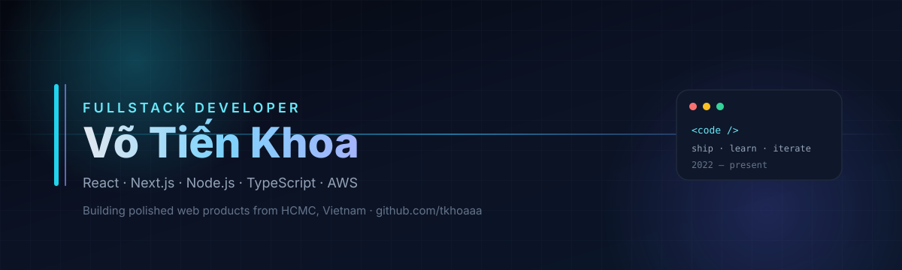

 

 

 

**Fresher Fullstack Developer** · HUTECH · Building web apps people actually use  
*Frontend-strong · Fullstack-ready · Cloud-curious*

---

## 👋 About me

My name is **Võ Tiến Khoa** — a fullstack developer based in **Ho Chi Minh City**, focused on clean UI, solid APIs, and products that go beyond demos.

- 🎓 **HUTECH** — Information Technology / Software Engineering (2022 – 2026)
- 💼 Intern experience: **Frontend** (Ngoc Thien Long) · **Fullstack / AWS** (Amplify, Lambda, API Gateway)
- 🔭 Currently shipping **LingoRise** — IELTS & TOEIC learning platform
- 🌱 Deepening **TypeScript**, **system design**, and **AWS** delivery patterns
- 💬 Ask me about React, Next.js, REST APIs, JWT auth, or product UX
- ⚡ Fun fact: I turn side tools into real apps (Electron widgets, folk games, booking systems)

---

## 🚀 Featured projects

> Real products from my GitHub & local work — not placeholder cards.

<table>
  <tr>
    <td width="50%" valign="top">
      <h3>📘 LingoRise</h3>
      
<b>IELTS & TOEIC Learning Platform</b>

      
Vietnamese-first EdTech: exam engine, speaking recorder, learner dashboard, PayOS checkout, Cognito JWT, PostgreSQL + AWS (Amplify / Lambda / S3 / CloudFront).

      

        <code>Next.js</code> <code>TypeScript</code> <code>Node.js</code> <code>PostgreSQL</code> <code>AWS</code>
      

      

        🔗 <a href="https://lingorise.xyz/">lingorise.xyz</a>
      

    </td>
    <td width="50%" valign="top">
      <h3>🎓 HUTECH Admission</h3>
      
<b>Online Admissions System</b>

      
Multi-step enrollment SPA, scholarships, counseling, result lookup + Admin Dashboard. JWT, dark mode, SEO, PWA; Lighthouse ~70 → ~92.

      

        <code>React</code> <code>Vite</code> <code>Tailwind</code> <code>Node.js</code> <code>MySQL</code>
      

      

        🔗 <a href="https://hutech-admission.vercel.app/">Live demo</a>
        · <a href="https://github.com/tkhoaaa/HutechAdmission">Repo</a>
      

    </td>
  </tr>
  <tr>
    <td width="50%" valign="top">
      <h3>💬 KMess</h3>
      
<b>Cross-platform Social App</b>

      
Social network + realtime chat, stories, voice/video (WebRTC), notifications and moderation — Flutter mobile + Node/Firebase stack.

      

        <code>Flutter</code> <code>Dart</code> <code>Firebase</code> <code>WebRTC</code> <code>Socket.IO</code>
      

      

        📦 <a href="https://github.com/tkhoaaa/Kmess-App">Kmess-App</a>
        · <a href="https://github.com/tkhoaaa/DoAnKMess">DoAnKMess</a>
      

    </td>
    <td width="50%" valign="top">
      <h3>🍽️ Booking Restaurant</h3>
      
<b>Table & Menu Booking System</b>

      
Restaurant ops: book tables, order food, roles (admin / shipper / customer), JWT + realtime updates with Socket.io.

      

        <code>React</code> <code>Express</code> <code>MongoDB</code> <code>Socket.io</code> <code>Redux</code>
      

      

        📦 <a href="https://github.com/tkhoaaa/QuanLi-BookingRes">QuanLi-BookingRes</a>
      

    </td>
  </tr>
  <tr>
    <td width="50%" valign="top">
      <h3>🕹️ VietFolk Games</h3>
      
<b>Vietnamese Folk Games MVP</b>

      
Playable traditional games (Bầu Cua, Oẳn Tù Tì, Đố vui…) with leaderboard & profile — Next.js App Router + Prisma / Supabase path.

      

        <code>Next.js</code> <code>TypeScript</code> <code>Prisma</code> <code>Tailwind</code>
      

      

        📦 <a href="https://github.com/tkhoaaa/Vietfolk-game">Vietfolk-game</a>
      

    </td>
    <td width="50%" valign="top">
      <h3>🪟 ToolChat Widget</h3>
      
<b>Floating Messenger Desktop App</b>

      
Lightweight always-on-top, frameless Electron widget for Facebook Messenger — auto-login, global shortcuts, distraction-free mode.

      

        <code>Electron</code> <code>JavaScript</code> <code>Node.js</code>
      

      

        🌐 <a href="https://github.com/tkhoaaa/ToolChatWidgetMess">ToolChatWidgetMess</a> · Public
      

    </td>
  </tr>
</table>

### More from the lab

| Project | What it is | Stack |
|--------|------------|--------|
| [**portfolio-vtk**](https://www.portfolio-votienkhoa.online/) | Personal portfolio (VI/EN) | React · TypeScript · Tailwind · Vite |
| **API-Proxy** | OpenAI-compatible streaming edge proxy | Cloudflare Workers · Hono · TypeScript |
| **Chat Realtime** | Instagram-style messaging web app | React · Node · Socket.IO · MySQL |
| **Agriplanner** | Smart agriculture planning platform | Java Spring Boot · HTML/JS · SQL |
| **GGTranslate Widget** | Always-on-top translate desktop tool | Electron |

---

## 🛠️ Tech stack

### Frontend

### Backend & Data

### Cloud, Tools & Workflow

 

**Core** — HTML5 · CSS3 · JavaScript (ES6+) · TypeScript · React · Next.js · Node.js · Express · REST · PostgreSQL · Tailwind  
**Working** — TanStack Query · React Hook Form · Zod · JWT / Cognito · Socket.IO · Git · ESLint  
**Exploring** — AWS Amplify · Lambda · S3 · CloudFront · Playwright · shadcn/ui · payment webhooks

---

## 📊 GitHub pulse

  
  

 

  

 

  
  

---

## 🐍 Contribution graph

  <picture>
    <source media="(prefers-color-scheme: dark)" srcset="https://raw.githubusercontent.com/tkhoaaa/tkhoaaa/output/github-contribution-grid-snake-dark.svg" />
    <source media="(prefers-color-scheme: light)" srcset="https://raw.githubusercontent.com/tkhoaaa/tkhoaaa/output/github-contribution-grid-snake.svg" />
    
  </picture>

---

## 🏆 Trophies

  

---

## 📬 Let's connect

| | |
|:--|:--|
| 🌐 Portfolio | [portfolio-vtk.vercel.app](https://portfolio-vtk.vercel.app/) |
| 💼 LinkedIn | [linkedin.com/in/vo-tien-khoa](https://www.linkedin.com/in/vo-tien-khoa) |
| ✉️ Email | [votienkhoa111@gmail.com](mailto:votienkhoa111@gmail.com) |
| 📱 Phone | 0867 674 376 |
| 📍 Base | Ho Chi Minh City, Vietnam |

 

  

**Thanks for stopping by — open to intern / fresher fullstack opportunities.**  
*"Ship · Learn · Iterate"*

