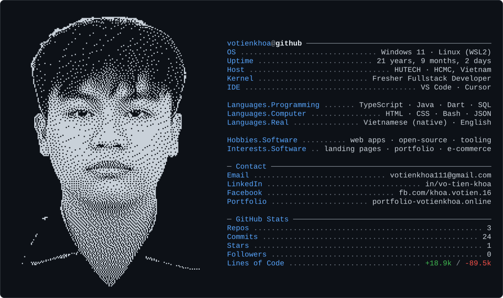

<picture>
  <source media="(prefers-color-scheme: dark)" srcset="./dark_mode.svg">
  <source media="(prefers-color-scheme: light)" srcset="./light_mode.svg">
  
</picture>

---

### Featured projects

| Project | What it is | Stack | Links |
| --- | --- | --- | --- |
| **LingoRise** | IELTS & TOEIC platform — exam engine, speaking recorder, PayOS payments, Cognito JWT auth | Next.js · TypeScript · Node.js · PostgreSQL · AWS | [live](https://lingorise.xyz/) |
| **HUTECH Admission** | Online admissions SPA + admin dashboard, JWT, PWA (Lighthouse 70 → 92) | React · Vite · Tailwind · MySQL | [live](https://hutech-admission.vercel.app/) · [source](https://github.com/tkhoaaa/HutechAdmission) |
| **KMess** | Cross-platform social app — realtime chat, stories, voice/video calls (WebRTC) | Flutter · Dart · Firebase · Socket.IO | [source](https://github.com/tkhoaaa/Kmess-App) |
| **ToolChat Widget** | Floating Messenger desktop widget — always-on-top, frameless, global shortcuts | Electron · JavaScript · Node.js | [source](https://github.com/tkhoaaa/ToolChatWidgetMess) |

<!--
  The card above is a single self-contained SVG generated by scripts/generate.py
  from config.yaml (text) + the Braille portrait in assets/braille_art*.txt, and
  refreshed daily by .github/workflows/update.yml.
  - Edit text/contact/stats  ->  config.yaml, then: python scripts/generate.py
  - Change the portrait photo ->  scripts/gen_ascii.py  (see docs/SETUP.md)
-->
